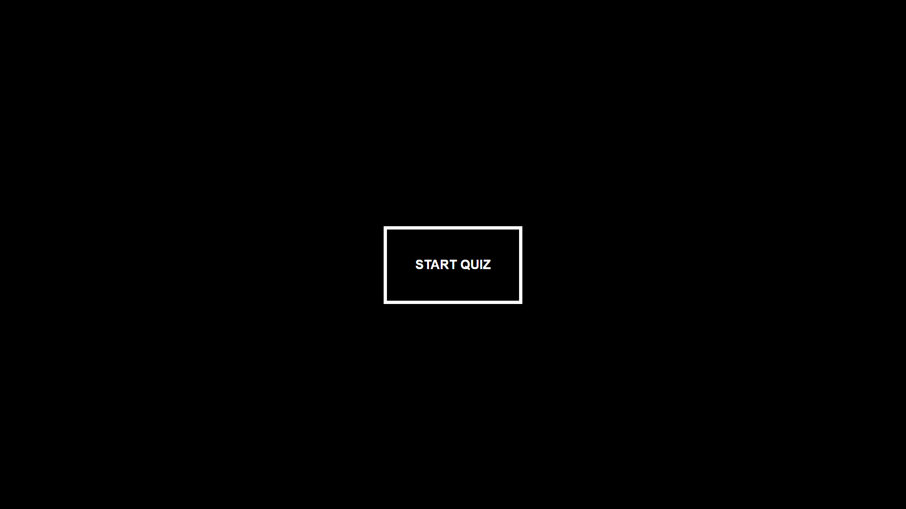
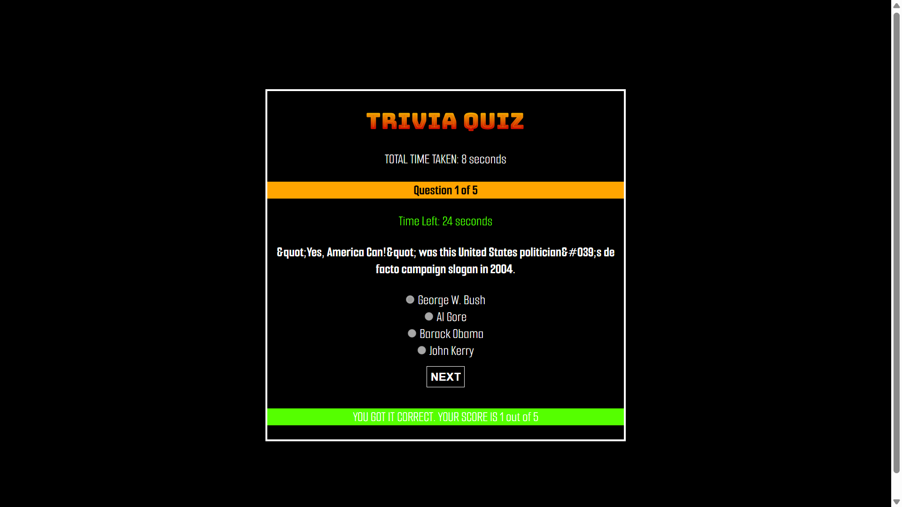
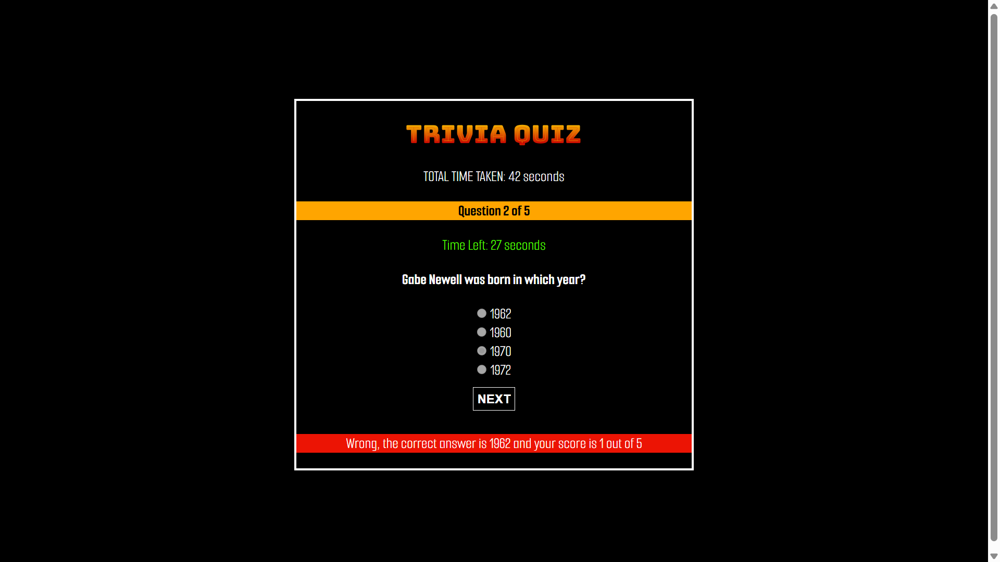
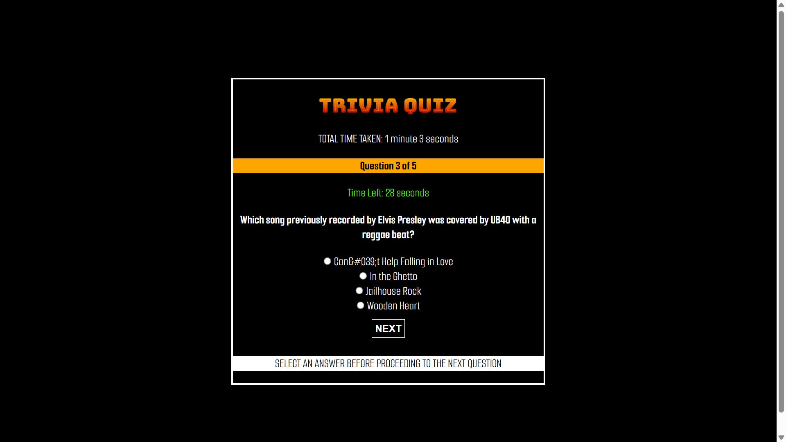
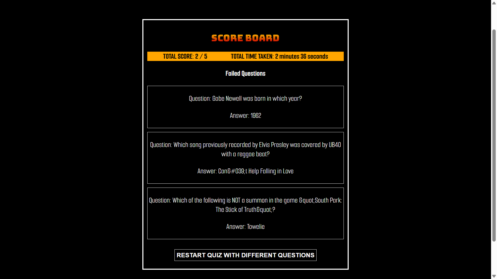

# Phase 1 Final Project: Trivia Quiz Game

## Description

This project is a Single Page Application(SPA) for a multiple choice interactive quiz game. The game includes:

* A start page with a "Start Quiz" button.
* Multiple-choice questions with options. Only one answer is correct.
* A score tracker that keeps track of how many questions were answered correctly.
* At the end of the quiz, show the user’s score and an option to restart the quiz. 

It tests the 3 pillars of web programming which are:

1.  **DOM Manipulation:** Select, create or remove specific HTML elements and dynamically style them in CSS using JavaScript
2.  **Recognizing Events:** Add event listeners to buttons and forms that will trigger callback functions when the events are detected
3.  **Communicating with the server:** Send requests and get responses from the server

The user can:

1. Click on "Start Quiz" button to start answering questions.

    

2. Click on the answer to a question and get a notification on whether it's correct or not. (No persistence needed)

    * CORRECT ANSWER 
    

    * INCORRECT ANSWER
    

    * STARTING THE NEXT QUESTION WITHOUT ANSWERING THE CURRENT ONE
    

3. See their total score on a Score Board after they've answered all the questions. (No persistence needed)

    

4. See all the correct answers to the questions they got wrong. (No persistence needed)

5. Click on "Restart Quiz" to restart the quiz with either the same or different set of questions.

6. See a timer that counts down how much time they have to answer a single question.

7. Click on a "Next Question" button to see the next question instead of displaying all the questions in one page.

8. A timer that shows how long they've taken to answer all the questions.

## Project Video Walkthrough

Below is the link to the project video. Search for the video called `Eric-Njuguna-trivia-video.mp4`

[https://drive.google.com/drive/folders/1deAe_8P788kJi8w9W8-JbgYOCwdSOm-9](https://drive.google.com/drive/folders/1deAe_8P788kJi8w9W8-JbgYOCwdSOm-9)

## How to Install and Run the Project

To get started, you will need to clone this repository to your local machine. Follow these steps:

1.  **Ensure Git is Installed:** If you don't have Git installed on your computer, download and install it from [https://git-scm.com/downloads](https://git-scm.com/downloads).

2.  **Open Your Terminal or Command Prompt:** Navigate to the directory where you want to save the files.

3.  **Clone the Repository:** Use the following command:

    ``` bash
    git clone git@github.com:Moringa-SDF-PT10/Eric-Njuguna-trivia-project.git
    ```

    This will create a new directory(`Eric-Njuguna-trivia-project`) containing the following inside:
    1. Directories(`assets`(Contains the images))

    2. Files (`index.html`, `index.js`, `README.md` ,`styles.css`)

4.  **Navigate to the Directory:** Change your current directory to the newly created folder:

    ``` bash
    cd Eric-Njuguna-trivia-project
    ```

5. **Open VS Code:**

    ``` bash
    code .
    ```

6. **Open `index.html` in the browser of your choice:**  Open the `index.html` file (located in the `Eric-Njuguna-trivia-project` directory) in the web browser eg Chrome, Firefox, Edge, Safari

## Contact

Eric Brian Njuguna - eric.njuguna@student.moringaschool.com

Project Link: [https://github.com/Moringa-SDF-PT10/Eric-Njuguna-trivia-project](https://github.com/Moringa-SDF-PT10/Eric-Njuguna-trivia-project)